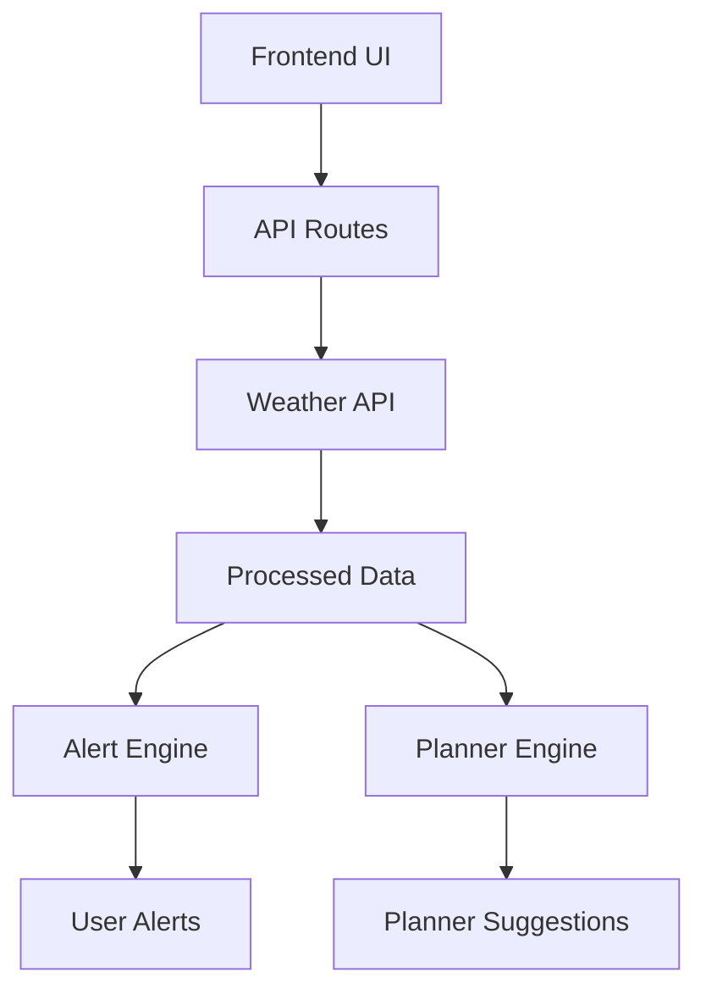

##  Live Application

 **Access the deployed app here:**
👉 **[https://hingaplus.onrender.com](https://hingaplus.onrender.com)**

---

##  Overview

**HingaPlus** is a modern, lightweight farming assistant that helps users make **data-driven agricultural decisions** using real-time weather data.

Designed with a **no-database architecture**, it ensures:

*  Fast performance
*  Simple deployment
*  Accessibility for low-resource environments

---

##  Key Features

###  Real-Time Weather Tracking

* Live weather data from external APIs
* Monitors:

  * Temperature 🌡️
  * Rainfall 🌧️
  * Weather conditions ☁️

---

###  Smart Weather Alerts

* Automatically detects:

  * Rain predictions
  * Weather risks
* Provides actionable insights:

  > “🌧️ Rain expected — delay harvesting.”

---

###  Farmer Planner

* Suggests optimal farming activities:

  *  Planting
  *  Harvesting
  *  Soil preparation

---

###  Supported Locations

* Ndora (Gisagara)
* Muhanda (Ngororero)
* Mvundwa  (Karongi)

---

###  Clean Architecture

* Modular and scalable:

  * API routes
  * Hooks
  * Services
  * Components


##  Tech Stack

| Layer       | Technology         |
| ----------- | ------------------ |
| Frontend    | Next.js            |
| Backend     | Next.js API Routes |
| Language    | TypeScript         |
| Data Source | Open-Meteo API     |
| Deployment  | Render             |

---

##  Project Structure

```
hingaplus/
│
├── src/
│   ├── app/
│   │   ├── api/
│   │   │   ├── weather/
│   │   │   ├── alerts/
│   │   │   └── crops/
│   │   │
│   │   ├── layout.tsx
│   │   └── page.tsx
│   │
│   ├── components/
│   ├── hooks/
│   ├── lib/
│
├── .env.local
├── package.json
└── next.config.ts
```

---

##  Setup Instructions

### 1️⃣ Clone the Repository

```bash
git clone https://github.com/your-username/hingaplus.git
cd hingaplus
```

---

### 2️⃣ Install Dependencies

```bash
npm install
```

---

### 3️⃣ Configure Environment Variables

Create a `.env.local` file:

```env
WEATHER_API_URL=https://api.open-meteo.com
```

---

### 4️⃣ Run the App Locally

```bash
npm run dev
```

 Open:

```
http://localhost:3000
```

---

##  API Endpoints

| Endpoint       | Description                 |
| -------------- | --------------------------- |
| `/api/weather` | Fetch weather data          |
| `/api/alerts`  | Generate smart alerts       |
| `/api/crops`   | Provide farming suggestions |

---

##  System Workflow



---

##  Deployment

This project is deployed on **Render** for public accessibility.

###  Live URL:

👉 [https://hingaplus.onrender.com](https://hingaplus.onrender.com)

---

##  Future Improvements

*  Push notifications for weather alerts
*  More User-selected locations
*  AI-powered crop recommendations
*  Offline-first support
*  Mobile optimization

---

##  Author

**Selena Isimbi**

*  Tech + Design Innovator
*  Passionate about sustainability
*  Bridging creativity and technology

---

##  License

This project is for **internship and pilot purposes**.

---

##  Final Note

> HingaPlus is a **practical, scalable solution** designed to empower farmers with accessible technology.

